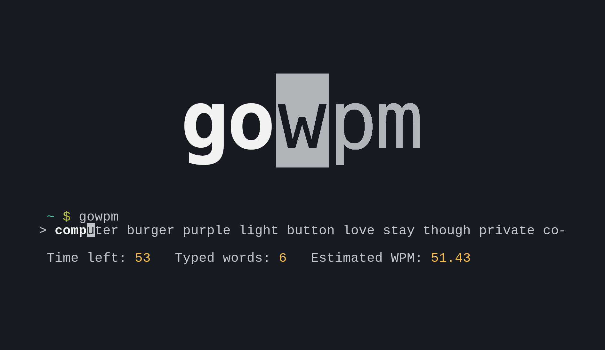

<h1 align="center">gowpm</h1>
<p align="center">A terminal wpm measurement program in Go</p>

<p align="center">
	<a href="./LICENSE">
		
	</a>
	<a href="https://github.com/LordOfTrident/gowpm/issues">
		
	</a>
	<a href="https://github.com/LordOfTrident/gowpm/pulls">
		
	</a>
	<br><br><br>
	
</p>

## Table of contents
* [Introduction](#introduction)
* [Quickstart](#quickstart)
* [Bugs](#bugs)
* [Make](#make)

## Introduction
A words per minute measurement TUI program written in Go. Its a remake of my
[pas-wpm](https://github.com/LordOfTrident/pas-wpm) program.

## Quickstart
```sh
$ make
$ make install
$ gowpm
```

## Bugs
- The prompt is gonna get spammed if you shrink the window width too fast
- In gnome-terminal and other terminals that wrap lines, the output may get messed up when you
  resize. This causes problems in other programs as well, so i dont really care. Use a better
  terminal :)

If you find any bugs, please create an issue and report them.

## Make
Run `make all` to see all the make rules.
